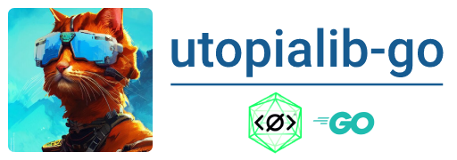

Utopia Ecosystem API wrapper written in Golang

Docs
-----

[](https://godoc.org/gopkg.in/sagleft/utopialib-go.v1)
[](https://goreportcard.com/report/github.com/Sagleft/utopialib-go)
[](https://travis-ci.org/sagleft/utopialib-go)

WARN! utopiago v1 deprecated, use v2 instead

Install
-----

```bash
go get github.com/Sagleft/utopialib-go/v2
```

then

```go
import (
	utopiago "github.com/Sagleft/utopialib-go/v2"
)
```

Usage example
-----

```go
package main

import (
	"fmt"
	"log"

	utopiago "github.com/Sagleft/utopialib-go/v2"
)

func main() {
	client := utopiago.NewUtopiaClient(utopiago.Config{
		Protocol: "http",
		Port:     22000,
		WsPort:   25000,
	})

	// print own contact data
	contactData, err := client.GetOwnContact()
	if err != nil {
		log.Fatalln(err)
	}
	fmt.Println(contactData)

	// print sync progress
	syncProgress, err := client.GetSyncProgress()
	if err != nil {
		log.Fatalln(err)
	}
	fmt.Println("sync status:", syncProgress, "%")
}
```

How can this be used?
-----

* creating a web service that processes client requests;
* creation of a payment service;
* development of a bot for the channel;
* utility for working with uNS;
* experiments to explore web3.0;

## Projects that use this library

Full list: https://github.com/Sagleft/utopialib-go/network/dependents

Other projects can be found here: https://udocs.gitbook.io/utopia-api/utopia-api/examples-of-projects

## generate mocks

just run:

```bash
make generate-mocks
```
